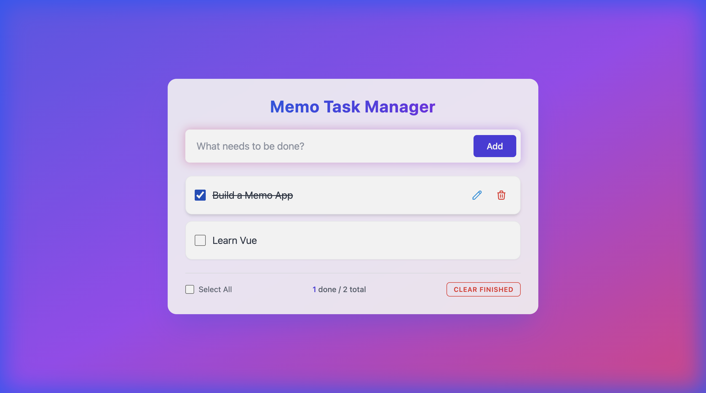

# Memo Task Manager

A modern, aesthetic, and responsive Todo List application built with Vue 3, Vite, and Tailwind CSS.
Designed with a focus on user experience and visual appeal, featuring smooth animations and a glassmorphism-inspired UI.



## Features

- ✨ **Modern Design**: Glassmorphism UI with vibrant gradients and smooth transitions.
- 📝 **Task Management**: Add, edit, delete, and mark tasks as complete.
- 💾 **State Management**: Powered by Pinia for robust state handling.
- 📱 **Responsive**: Fully responsive design that looks great on all devices.
- ⚡ **Confirmation Modals**: Custom-built confirmation dialogs for critical actions.

## Technology Stack

- **Vue 3**: The Progressive JavaScript Framework.
- **Vite**: Next Generation Frontend Tooling.
- **Tailwind CSS**: A utility-first CSS framework for rapid UI development.
- **Pinia**: The intuitive store for Vue.js.

## Getting Started

Follow these steps to get the project running on your local machine.

### Prerequisites

- [Node.js](https://nodejs.org/) (version 16 or higher recommended)
- [npm](https://www.npmjs.com/)

### Installation

1. **Clone the repository** (or unzip the project):
   ```bash
   git clone <repository-url>
   cd Memo
   ```

2. **Install dependencies**:
   ```bash
   npm install
   ```

### Running the Application

Start the development server:

```bash
npm run dev
```

Open your browser and navigate to `http://localhost:5173/` (or the URL shown in your terminal).

### Building for Production

To build the application for production:

```bash
npm run build
```

The output files will be in the `dist` directory.

### Preview Production Build

To preview the production build locally:

```bash
npm run preview
```

## Project Structure

```
Memo/
├── src/
│   ├── assets/       # Static assets
│   ├── components/   # Vue components (TodoInput, TodoList, etc.)
│   ├── stores/       # Pinia stores (todoStore, uiStore)
│   ├── App.vue       # Main application component
│   ├── main.js       # Application entry point
│   └── style.css     # Global styles and Tailwind directives
├── public/           # Public static assets
├── screenshots/      # Documentation screenshots
├── index.html        # Main HTML file
├── package.json      # Project dependencies and scripts
├── vite.config.js    # Vite configuration
└── tailwind.config.js # Tailwind CSS configuration
```

## License

MIT
